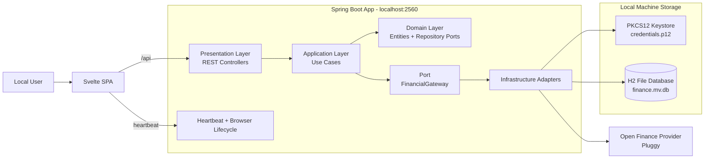

# Personal Finance Local (BYOK)

[](https://openjdk.org/projects/jdk/21/)
[](https://spring.io/projects/spring-boot)
[](https://kit.svelte.dev/)
[](https://tailwindcss.com/)
[](#architecture-and-patterns)
[](#getting-started-local-byok)
[](LICENSE)

Local-first personal finance manager that synchronizes banking data through Open Finance providers while keeping credentials and data on the user's machine.

## Table of Contents

- [Architecture & Motivation](#architecture--motivation)
- [Localization Scope (Important)](#localization-scope-important)
- [Engineering Highlights (Portfolio)](#engineering-highlights-portfolio)
- [Feature Highlights](#feature-highlights)
- [Architecture and Patterns](#architecture-and-patterns)
- [Tech Stack](#tech-stack)
- [Getting Started (Local BYOK)](#getting-started-local-byok)
- [Development Mode (Split Frontend/Backend)](#development-mode-split-frontendbackend)
- [API Surface](#api-surface)
- [Testing](#testing)
- [Desktop-like Portable Packaging](#desktop-like-portable-packaging)
- [Screenshots (Placeholders)](#screenshots-placeholders)
- [Project Structure](#project-structure)
- [Security and Privacy Notes](#security-and-privacy-notes)
- [License](#license)

## Architecture & Motivation

This project started as an engineering study to deeply practice:

- Java 21
- Spring Boot
- SOLID principles
- Clean Architecture
- Domain-Driven Design (DDD)

As the backend matured and the Svelte frontend evolved (visually inspired by modern fintech experiences), the system became strong enough to be evaluated as a potential SaaS.

After a technical and financial viability assessment, a critical constraint became clear: operating a cloud SaaS around third-party banking integrations would require sustained licensing spend plus ongoing legal/regulatory overhead in a highly sensitive data domain.

The architecture was intentionally pivoted to a **Local/BYOK model (Bring Your Own Key)**:

- The application runs on localhost.
- The user provides their own Open Finance API credentials.
- Credentials are stored locally.
- Data remains on the local machine.
- No mandatory cloud infrastructure is required.

This was not a rollback, but a deliberate system design decision prioritizing:

- Privacy by default
- Lower operational and compliance exposure
- Zero recurring infrastructure cost for end users
- Practical real-world utility with enterprise-grade engineering practices

## Localization Scope (Important)

Although the engineering approach, documentation style, and architecture follow global software engineering standards, the **current feature set and API integrations are tailored to the Brazilian financial ecosystem** (for example, Open Finance Brazil workflows and provider assumptions).

The current product UI and language content are also primarily focused on Brazilian Portuguese usage patterns.

## Engineering Highlights (Portfolio)

- Strong separation of concerns with DDD + Clean Architecture boundaries
- Business-centric use-case layer with explicit orchestration and error mapping
- Port-and-adapter integration strategy for external financial providers
- Local-first security posture (localhost binding, local keystore, local DB)
- Non-trivial analytics logic (adaptive cashflow granularity, category aggregations)
- Domain heuristics for movement classification (including internal transfer detection)
- Automated release workflow producing cross-platform portable artifacts
- Test suite covering core use cases and integration scenarios

## Feature Highlights

- Guided setup wizard for first-time onboarding
- BYOK credential onboarding (client id + client secret)
- Bank connection lifecycle (add/list/remove)
- Manual synchronization pipeline for categories, accounts, and transactions
- Dashboard analytics for current balance, income vs expenses, category breakdowns, and adaptive cashflow timeline (daily/weekly/monthly/yearly)
- Transaction explorer with filters, pagination, and sorting
- Internal-transfer-aware transaction classification to reduce metric distortion
- Local browser heartbeat and lifecycle control for desktop-like behavior
- OpenAPI/Swagger documentation out of the box
- Cross-platform portable packaging scripts (Windows, macOS, Linux)

## Architecture and Patterns

### DDD in Practice

The domain is modeled around explicit business concepts and value objects:

- Entities: `Account`, `Transaction`, `BankConnection`, `Category`, `UserCredential`
- Value objects/enums: `TransactionType`, `MovementClass`, `BankConnectionStatus`, `AccountType`, `AccountSubType`
- Domain repositories define persistence contracts without coupling domain logic to JPA or external APIs.

Business rules such as internal transfer identification and credit card payment pairing are implemented in use cases focused on domain behavior, not framework mechanics.

### Clean Architecture in Practice

The project follows layered boundaries:

- **Presentation**: REST controllers and API contracts
- **Application**: use cases orchestrating workflows
- **Domain**: core entities and repository interfaces
- **Infrastructure**: adapters for Pluggy, H2/JPA, local credential keystore, browser lifecycle integrations

The `FinancialGateway` port isolates third-party integration concerns so the use-case layer remains provider-agnostic.

### SOLID Application

- **Single Responsibility**: each use case handles one business action (`SyncBankDataUseCase`, `GenerateConnectTokenUseCase`, etc.)
- **Open/Closed**: ports/adapters allow infrastructure extension without changing application policy
- **Liskov/Interface Segregation**: repository and gateway contracts are narrow and purpose-driven
- **Dependency Inversion**: use cases depend on abstractions (`FinancialGateway`, repositories), not concrete integrations

### Mermaid Diagram



## Tech Stack

### Backend

- Java 21
- Spring Boot 4
- Spring Web + Validation + Data JPA
- H2 (file-based local persistence)
- SpringDoc OpenAPI
- Pluggy Java SDK

### Frontend

- SvelteKit 2 (SPA/static output)
- TypeScript
- Tailwind CSS 4
- ShadCN UI Components
- Vite

### Packaging and Delivery

- jpackage portable app-image scripts for Windows/macOS/Linux
- Semantic-release workflow for versioning and release automation

## Getting Started (Local BYOK)

### 1. Prerequisites

- JDK 21 (with `jpackage` available if you plan to package desktop artifacts)
- Bun (required because Maven build triggers frontend install/build)
- A Pluggy account with `clientId` and `clientSecret`
- Access to GitHub Packages for pulling `ai.pluggy:pluggy-java`

### 2. Configure Maven credentials for GitHub Packages

Create or update your Maven settings file:

- Linux/macOS: `~/.m2/settings.xml`
- Windows: `%USERPROFILE%\\.m2\\settings.xml`

Example:

```xml
<settings>
  <servers>
    <server>
      <id>github</id>
      <username>YOUR_GITHUB_USERNAME</username>
      <password>YOUR_GITHUB_TOKEN_WITH_PACKAGES_READ</password>
    </server>
  </servers>
</settings>
```

### 3. Run the application

From the repository root:

```bash
cd backend
./mvnw spring-boot:run
```

Windows PowerShell/CMD:

```powershell
cd backend
.\mvnw.cmd spring-boot:run
```

The app starts on:

- `http://127.0.0.1:2560`

### 4. Configure BYOK credentials (recommended path)

When the app opens, complete setup in UI:

1. Go through the setup wizard.
2. Paste your Pluggy `clientId` and `clientSecret`.
3. Connect at least one bank account via Pluggy Connect.
4. Trigger synchronization.
5. Start using dashboard, transactions, and settings.

### 5. Alternative credential setup via API

```bash
curl -X POST http://127.0.0.1:2560/api/credentials \
  -H "Content-Type: application/json" \
  -d '{"clientId":"YOUR_CLIENT_ID","clientSecret":"YOUR_CLIENT_SECRET"}'
```

### 6. Local data location

All local data is persisted under:

- `~/.cauecalil-personal-finance-app/`

Typical files:

- `credentials.p12` (local credential keystore)
- `finance.mv.db` (H2 database)

## Development Mode (Split Frontend/Backend)

Use this for iterative UI work:

Backend terminal:

```bash
cd backend
./mvnw spring-boot:run
```

Frontend terminal:

```bash
cd frontend
bun install
bun run dev
```

Vite runs on `http://localhost:5173` and proxies `/api` to `http://localhost:2560`.

## API Surface

Main endpoints:

- `POST /api/credentials`
- `GET /api/credentials/status`
- `DELETE /api/credentials`
- `POST /api/connect-token`
- `GET /api/bank-connections`
- `POST /api/bank-connections`
- `DELETE /api/bank-connections/{id}`
- `POST /api/sync`
- `GET /api/accounts`
- `GET /api/dashboard/metrics`
- `GET /api/dashboard/categories`
- `GET /api/dashboard/cashflow`
- `GET /api/transactions`
- `POST /api/heartbeat`

OpenAPI UI:

- `http://127.0.0.1:2560/swagger-ui.html`

## Testing

Backend tests include use-case-level unit tests and Spring/H2 integration test scaffolding.

Run tests:

```bash
cd backend
./mvnw test
```

## Desktop-like Portable Packaging

Build backend jar first:

```bash
cd backend
./mvnw clean package
```

Then package by platform:

Windows:

```powershell
./dist/scripts/package-windows.ps1 -AppVersion 1.0.0
```

macOS:

```bash
./dist/scripts/package-macos.sh 1.0.0
```

Linux:

```bash
./dist/scripts/package-linux.sh 1.0.0
```

Artifacts are generated in `dist/output`.

## Project Structure

```text
.
├─ backend/         # Spring Boot API, application/use-case/domain/infrastructure layers
├─ frontend/        # SvelteKit frontend (dashboard, setup, transactions, settings)
├─ dist/            # Cross-platform packaging scripts and artifacts
└─ .github/         # Release automation workflow
```

## Security and Privacy Notes

- Server binds to loopback (`127.0.0.1`) by default.
- Credentials are stored locally in a PKCS12 keystore.
- Financial data is stored locally in a file-based H2 database.
- No cloud persistence is required by design.
- Credential deletion also removes bank connections linked to the external provider.

## License

This project is licensed under the Apache License 2.0.

See [LICENSE](LICENSE) for full terms.